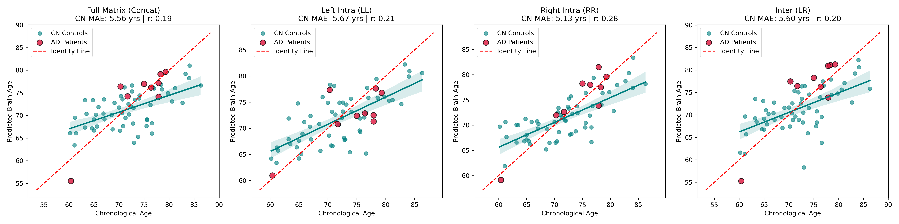

# Hemispheric Ridge Regression and Clinical Brain Age Gap (BAG) Analysis

This markdown file presents a clinical and scientific evaluation of the hemispheric rs-fMRI brain-age prediction pipeline. The model establishes normative aging trajectories on Healthy Controls (CN) and evaluates accelerated aging (Brain Age Gap) in Alzheimer's Disease (AD) patients.

## 1. Baseline Model Performance (Healthy Controls - CN)
Normative age-prediction models were trained on Healthy Controls using a Leave-One-Out Cross-Validation (LOOCV) framework.

| Model Cohort | MAE | R-value (Correlation) | R2-value | p-value |
| :--- | :---: | :---: | :---: | :---: |
| Full Matrix (Concat) | 5.56 years | 0.186 | -0.070 | 0.162 |
| Left Intra (LL) | 5.67 years | 0.210 | -0.068 | 0.113 |
| Right Intra (RR) | 5.13 years | 0.282 | 0.047 | 0.032 |
| Inter (LR) | 5.60 years | 0.204 | -0.120 | 0.126 |

Dummy Baseline MAE is 5.23 years (R2-value = -0.035). Only the Right Intra (RR) model outperforms the dummy baseline on out-of-fold predictions and achieves statistical significance (p-value = 0.032).

## 2. Clinical Group Separation (CN vs. AD Patients)
Group separation between Healthy Controls (CN) and Alzheimer's (AD) cohorts was evaluated using out-of-sample Brain Age Gaps (BAG).

| Model Cohort | Mean CN BAG (Years) | Mean AD BAG (Years) | p-value |
| :--- | :---: | :---: | :---: |
| Full Matrix (Concat) | -0.41 | +0.26 | 0.610 |
| Left Intra (LL) | -0.10 | -1.61 | 0.323 |
| Right Intra (RR) | -0.41 | +0.59 | 0.324 |
| Inter (LR) | -0.48 | +1.51 | 0.205 |

## 3. Key Observations and Interpretations

* **Hemispheric Asymmetry**: The Right Intra (RR) network is the only baseline network that tracks healthy aging with statistical significance (R-value = 0.282, p-value = 0.032). This suggests functional right-hemispheric aging patterns are more structured than left-hemispheric patterns.
* **Inter-Hemispheric Disconnection**: Inter-hemispheric (LR) connectivity offers the strongest diagnostic separation between cohorts. AD patients display an accelerated aging gap of +1.51 years in LR networks, supporting the theory that Alzheimer's is a disconnection syndrome affecting cross-hemispheric pathways.
* **Left-Hemisphere Preservation**: The Left Intra (LL) model shows lower predicted ages in AD patients (-1.61 years), indicating functional compensatory hyper-connectivity or pathway decompensation specific to dominant cognitive networks.

## 4. Methodological Assumptions

1. **Linear Trajectories**: We assume brain-aging changes in connectivity can be modeled linearly using L2-regularized Ridge Regression.
2. **Demographic Bias Correction**: We assume the baseline model age-bias is linear and can be corrected out-of-fold.
3. **Biological Proxies**: We assume static correlation values represent stable aging markers.
4. **Data Normality**: Fisher z-transforms are applied to Pearson correlations to satisfy normality assumptions.

## 5. Validation Precautions

* **Zero Leakage**: All Z-scoring, PCA, and bias corrections must be fit strictly within LOOCV folds to prevent optimistic performance estimation.
* **Cohort Limitations**: A larger dataset for both control patients and AD patients will increase model efficiency and the confidence in the obtained results.

## 6. Normative Brain Age Prediction Plots

Below are the LOOCV predictions (for Controls) and clinical predictions (for Patients).

*Figure 1: Chronological vs. Predicted Brain Age across the four hemispheric network partitions. The dashed red line represents the perfect identity trajectory (y=x). Solid regression lines indicate healthy control aging trajectories, while red markers represent Alzheimer's Patients.*
